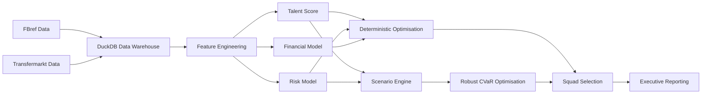
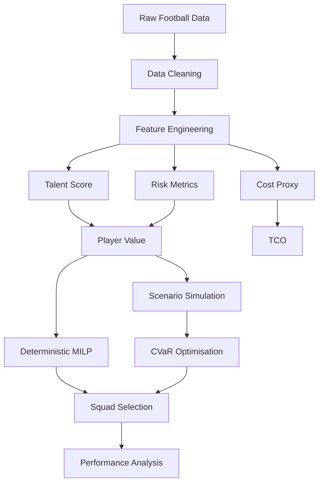

# Risk‑Adjusted Scouting

### Budget‑Constrained Football Recruitment Decision System (v2.1)

End‑to‑end football recruitment modelling framework integrating
**performance analytics, risk modelling, financial constraints, scenario
simulation, and mixed‑integer optimisation**.

------------------------------------------------------------------------

# 🔎 Project Overview

This project builds a **club‑ready recruitment decision system**, not
just a ranking model.

It integrates:

-   Multi‑source football data (FBref + Transfermarkt)
-   Position‑aware talent modelling
-   Player risk estimation
-   Financial modelling via Total Cost of Ownership (TCO)
-   Budget‑constrained squad optimisation (MILP)
-   Scenario‑based uncertainty simulation
-   **CVaR robust optimisation**
-   Executive reporting outputs
-   **Real club recruitment case study**

The goal is to simulate **realistic recruitment decisions under
financial and structural constraints**, closer to how clubs actually
allocate transfer budgets.

------------------------------------------------------------------------

## Project Highlights

-   End-to-end football recruitment decision system
-   Risk-adjusted player evaluation
-   Budget-constrained squad optimisation
-   Scenario simulation under uncertainty
-   Robust optimisation (CVaR)
-   Real club recruitment case study

Technologies:

DuckDB · Python · MILP · Monte Carlo · CVaR optimisation

------------------------------------------------------------------------

# 🧠 System Architecture

------------------------------------------------------------------------

# 📊 Analytical Pipeline

------------------------------------------------------------------------

# 📊 Key Outputs

## Budget vs Downside Performance

Robust optimisation significantly improves **tail performance** of the
squad portfolio.

Deterministic optimisation maximises expected value, while CVaR
optimisation reduces exposure to extreme negative scenarios.

Example result (Notebook 07):

  Budget (€M)   Mean    P10     CVaR
  ------------- ------- ------- -------
  120           14.55   -0.02   -6.58
  154           17.49   5.99    0.83
  200           21.66   11.89   7.21

Increasing recruitment investment **systematically improves downside
performance**.

------------------------------------------------------------------------

# 🧩 Core Methodology

## 1️⃣ Data Architecture

-   FBref + Transfermarkt ingestion
-   Relational modelling in **DuckDB**

Fact tables:

    fact_player_season_fbref_tm
    fact_player_season_availability
    fact_player_market_value

Key properties:

-   strict season alignment
-   deduplicated joins
-   one row per `(player, season)`

------------------------------------------------------------------------

## 2️⃣ Talent Model

Position‑aware composite score:

    Talent = w1·z(goals90) + w2·z(assists90) + w3·z(minutes)

Features:

-   computed within positional groups
-   Z‑score normalisation
-   weighted aggregation

Produces a **cross‑position comparable performance metric**.

------------------------------------------------------------------------

## 3️⃣ Risk Model

    Risk = z(|age − 24|) + z(minutes volatility)

Captures:

-   deviation from peak age
-   playing time instability

Negative values indicate **safer‑than‑average players**.

------------------------------------------------------------------------

## 4️⃣ Financial Model --- Total Cost of Ownership

Recruitment is treated as a **capital allocation problem**.

    TCO = Transfer Fee + discounted wage stream

Assumptions:

-   Wage ratio ≈ 15% of market value
-   Contract length ≈ 4 years
-   Discount rate ≈ 8%

------------------------------------------------------------------------

## 5️⃣ Deterministic Optimisation

Binary MILP formulation:

    max Σ xᵢ (Talentᵢ − λ Riskᵢ)

Subject to:

-   transfer budget
-   squad size
-   positional quotas

Solved using:

    scipy.optimize.milp
    HiGHS solver

------------------------------------------------------------------------

## 6️⃣ Scenario Simulation

Player value is simulated under uncertainty.

Two engines are implemented.

### Regime Stress Testing

Models macro football environments:

-   normal season
-   moderate performance shock
-   severe negative shock

### Monte Carlo Factor Model

Simulates player volatility with:

-   common performance shocks
-   idiosyncratic noise

------------------------------------------------------------------------

## 7️⃣ Robust Optimisation --- CVaR

To control downside risk, the optimisation problem is reformulated using
**Conditional Value at Risk (CVaR)**.

The model maximises expected squad value while protecting against
**worst‑case scenarios**.

This produces **downside‑aware recruitment strategies**.

------------------------------------------------------------------------

## 8️⃣ Real Club Case Study

The final stage of the project demonstrates how the full decision system
could be used by a professional football club.

Scenario:

-   Mid-table Big 5 league club
-   €200M recruitment budget
-   18-player squad construction

The notebook compares:

**Deterministic optimisation** - maximises expected squad value

**Robust CVaR optimisation** - protects against worst-case scenarios

Key analyses include:

-   deterministic vs robust squad comparison
-   player replacement analysis
-   budget allocation across positions
-   budget vs downside performance frontier

The case study illustrates how **accounting for uncertainty materially
changes recruitment decisions**.

------------------------------------------------------------------------

# 📈 Key Insights

### Robust optimisation improves downside stability

Across budgets:

-   CVaR squads improve **P10 and CVaR**
-   selected players exhibit **lower uncertainty (σ)**

### Robust squads are structurally different

Deterministic vs robust squads show **large Hamming distances**,
indicating fundamentally different recruitment strategies.

### Robust premium trade‑off

Robust optimisation sacrifices some expected value but dramatically
improves downside protection.

This mirrors classical **portfolio optimisation trade‑offs**.

------------------------------------------------------------------------

# 🏗 Project Structure

    risk-adjusted-scouting/
    │
    ├── db/
    │   └── scouting.duckdb
    │
    ├── notebooks/
    │   ├── 02_talent_score_v1.ipynb
    │   ├── 03_risk_adjusted_value_and_sensitivity.ipynb
    │   ├── 04_budget_constrained_optimisation.ipynb
    │   ├── 05_reporting_and_executive_summary.ipynb
    │   ├── 06_robust_optimisation_cvar.ipynb
    │   └── 07_real_club_case_study.ipynb
    │
    ├── assets/
    │   ├── 18man_budget_sensitivity.png
    │   └── age_distribution_squad18.png
    │
    └── README.md

------------------------------------------------------------------------

# 🚀 Running the Project

1️⃣ Ensure database exists

    db/scouting.duckdb

2️⃣ Run notebooks sequentially

    02 → Feature engineering
    03 → Risk‑adjusted modelling
    04 → Deterministic optimisation
    05 → Reporting
    06 → Robust CVaR optimisation
    07 → Real club recruitment case study

------------------------------------------------------------------------

# 🎯 Why This Project Is Different

Most football analytics projects stop at **player ranking models**.

This project implements a **decision system** that:

-   integrates performance + financial modelling
-   enforces squad constraints
-   models uncertainty
-   applies robust optimisation
-   outputs **executable squad configurations**

It bridges the gap between **analytics research and real recruitment
decisions**.

------------------------------------------------------------------------

# 🔮 Future Extensions

Potential improvements:

-   correlated positional shocks
-   injury probability modelling
-   multi‑season squad planning
-   transfer fee vs wage decomposition
-   Bayesian uncertainty modelling

------------------------------------------------------------------------

# 📌 Status

**v2.1 --- Robust optimisation + recruitment case study implemented**

Pipeline includes:

-   Data ingestion
-   Risk‑adjusted modelling
-   Deterministic MILP optimisation
-   Scenario simulation
-   CVaR robust optimisation
-   Real club recruitment case study
-   Budget frontier analysis

------------------------------------------------------------------------

# 👤 Author

Manuel Pérez Bañuls \
Data Science & Football Performance Analytics
