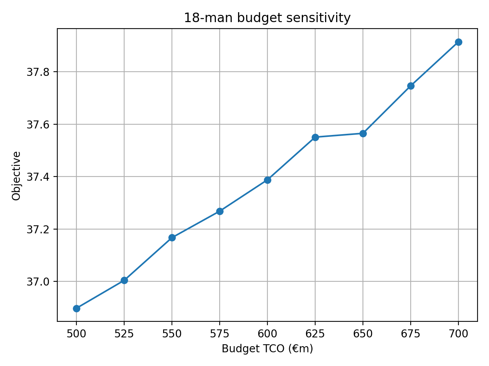
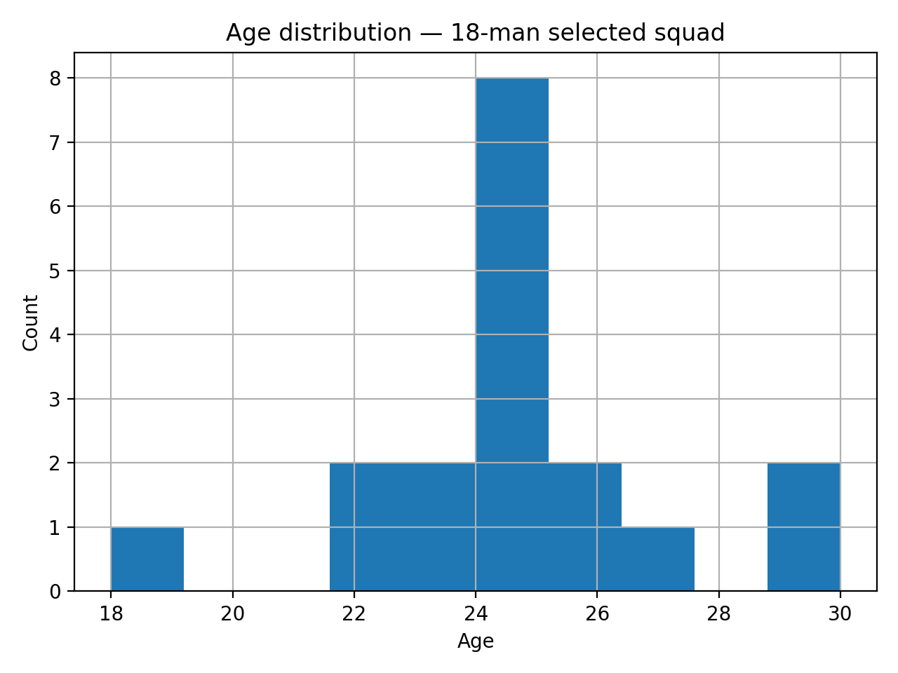

# Risk-Adjusted Scouting  
### Budget-Constrained Football Recruitment Decision System (v1.0)

End-to-end football recruitment modelling framework integrating performance analytics, risk modelling, financial constraints, and mixed-integer optimisation.

---

## 🔎 Project Overview

This project builds a **club-ready recruitment decision system**, not just a ranking model.

It combines:

- Multi-source data ingestion (FBref + Transfermarkt)
- Position-aware talent scoring
- Risk-adjusted evaluation
- Total Cost of Ownership (TCO) modelling
- Budget-constrained squad optimisation (MILP)
- Executive reporting layer

The objective is to simulate realistic recruitment decisions under financial and structural constraints.

---

# 📊 Key Figures

## 18-man Budget Sensitivity

Increasing budget beyond ~€600m TCO yields diminishing marginal gains in objective value, indicating structural stability of the optimal core squad.



---

## Age Distribution — Selected 18-Man Squad

The optimisation naturally produces a youth-oriented squad structure concentrated around 23–26 years old (avg ~24.5).



---

# 🧠 Core Methodology

## 1️⃣ Data Architecture

- FBref + Transfermarkt ingestion
- Relational modelling in DuckDB
- Fact tables:
  - `fact_player_season_fbref_tm`
  - `fact_player_season_availability`
  - `fact_player_market_value`
- Strict season alignment
- Deduplicated availability joins (one row per player-season)

---

## 2️⃣ Talent Modelling

Position-aware composite score:

\[
Talent = w_1 \cdot z(g90) + w_2 \cdot z(a90) + w_3 \cdot z(minutes)
\]

- Computed within positional groups (GK / DF / MF / FW)
- Z-score normalisation
- Weighted aggregation

---

## 3️⃣ Risk Modelling

\[
Risk = z(|age - 24|) + z(minutes\ volatility)
\]

Captures:

- Distance from peak age
- Availability instability

Negative aggregated risk → safer-than-average profiles.

---

## 4️⃣ Financial Modelling — Total Cost of Ownership

\[
TCO = Transfer\ Fee + \sum_{t=1}^{T} \frac{Wage}{(1+r)^t}
\]

Parameters:

- Wage ratio: 15% of market value
- Contract length: 4 years
- Discount rate: 8%

Transforms scouting into a capital allocation problem.

---

## 5️⃣ Decision Layer — Binary MILP Optimisation

\[
\max_x \sum_i x_i (Talent_i - \lambda Risk_i)
\]

Subject to:

- Budget constraint (TCO)
- Exact squad size
- Hard positional quotas
- Optional:
  - Maximum average age
  - Maximum total risk

Implemented using:

- `scipy.optimize.milp`
- HiGHS solver
- Binary integrality constraints

Supports:

- K-signings reinforcement
- 18-man squad construction
- 23-man squad construction
- Budget sensitivity analysis
- Lambda sensitivity sweep

---

# 📌 Key Insights (v1.0)

- **Decision-layer validation:** The MILP optimiser saturates TCO budgets while satisfying structural constraints, producing executable squad configurations rather than generic rankings.
  
- **Diminishing returns:** For the 18-man configuration, increasing TCO beyond ~€600m generates marginal objective gains, indicating early stabilisation of the optimal core.

- **Endogenous youth bias:** The selected squads cluster around 23–26 years old without explicitly enforcing youth constraints — a natural outcome of combining risk modelling and financial realism.

- **Risk interpretation:** Risk is standardised; negative total risk reflects safer-than-average aggregated profiles.

- **Structural robustness:** Ensuring one row per (player, season) in availability data is critical. After deduplication, optimisation outputs are structurally consistent.

---

# 🏗 Project Structure


```bash
risk-adjusted-scouting/
│
├── db/
│ └── scouting.duckdb
│
├── notebooks/
│ ├── 02_talent_score_v1.ipynb
│ ├── 03_risk_adjusted_value_and_sensitivity.ipynb
│ ├── 04_budget_constrained_optimisation.ipynb
│ └── 05_reporting_and_executive_summary.ipynb
│
├── assets/
│ ├── 18man_budget_sensitivity.png
│ └── age_distribution_squad18.png
│
└── README.md
```

---

## 🚀 How to Run

1. Ensure DuckDB database exists at:

`db/scouting.duckdb`

2. Execute notebooks sequentially:

- 02 → Feature engineering
- 03 → Risk-adjusted modelling
- 04 → MILP optimisation layer
- 05 → Reporting layer

---

# 🎯 What Makes This Different

This is not a scouting ranking notebook.

It is a **capital allocation and optimisation framework** that:

- Integrates performance and financial modelling
- Applies hard structural constraints
- Produces executable squad configurations
- Supports scenario planning

It bridges analytics and real recruitment decision-making.

---

# 🧾 5-Minute Technical Walkthrough

**Problem framing:**  
Build an end-to-end recruitment decision system that outputs executable squad configurations under financial and structural constraints.

**Data layer:**  
Structured relational modelling in DuckDB with season alignment and join integrity validation.

**Modelling layer:**  
Position-aware talent scoring + standardised risk proxy.

**Financial realism:**  
Total Cost of Ownership with discounted wage streams.

**Optimisation:**  
Binary MILP via SciPy HiGHS with budget, squad size, and positional constraints.

**Outputs:**  
Scenario shortlists, sensitivity curves, and executive-ready tables.

---

# 🔮 Future Extensions (v2.0 Ideas)

- CVaR-based downside risk modelling
- Robust optimisation under parameter uncertainty
- Multi-season planning horizon
- Injury probability modelling
- Market inefficiency detection

---

# 📌 Status

**v1.0 — End-to-end pipeline complete**

Includes:

- Data ingestion
- Risk-adjusted modelling
- MILP decision layer
- Executive reporting
- Budget sensitivity analysis

---

## 👤 Author

Manuel Pérez Bañuls
Data Science & Football Performance Analytics
Portfolio Project
