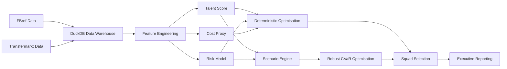

# System Architecture — Risk Adjusted Scouting

This document describes the architecture of the recruitment decision system.

---

## High Level Pipeline

---

## Analytical Layers

The system contains six analytical layers:

1. Data ingestion and relational modelling
2. Feature engineering
3. Talent modelling
4. Risk modelling
5. Financial modelling (TCO)
6. Optimisation and robust optimisation

---

## Decision System Output

The pipeline produces:

* optimal squad compositions
* shortlist recommendations
* risk-aware recruitment strategies
* executive reporting outputs

---

## Key Technologies

| Component           | Technology         |
| ------------------- | ------------------ |
| Data warehouse      | DuckDB             |
| Data processing     | Python / Pandas    |
| Optimisation        | SciPy MILP (HiGHS) |
| Scenario modelling  | Monte Carlo        |
| Robust optimisation | CVaR MILP          |
| Visualisation       | Matplotlib         |

---

## Design Philosophy

The project focuses on **decision intelligence**, not just predictive modelling.

Instead of ranking players, the system produces **optimal recruitment decisions under financial and risk constraints**.
